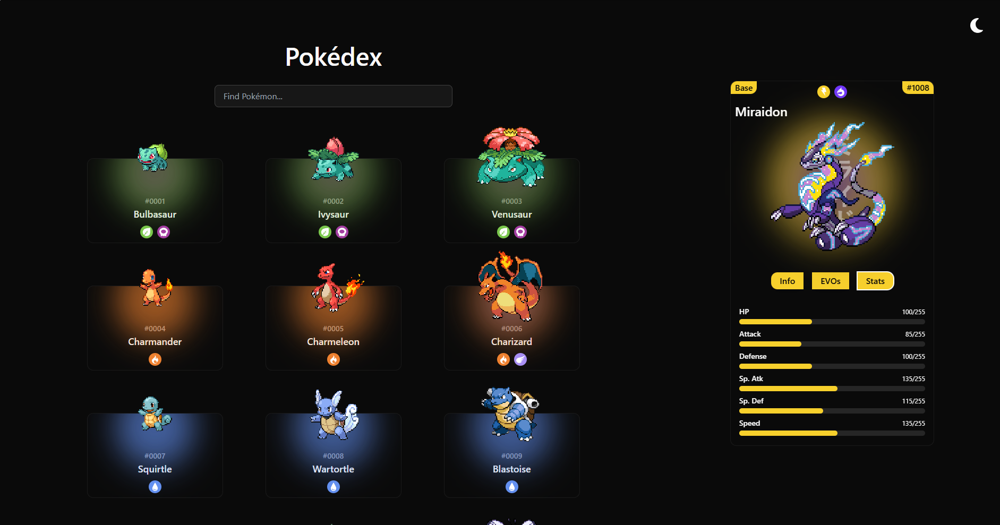

# 🧭 Pokédex App

A responsive Pokédex web application built with [Next.js](https://nextjs.org/), [TypeScript](https://www.typescriptlang.org/), and [Tailwind CSS](https://tailwindcss.com/). It fetches data from the [PokéAPI](https://pokeapi.co/) to display information about various Pokémon, including their types and stats.

## 🚀 Features

- 🔎 Search functionality to find Pokémon by name or ID
- 📱 Fully responsive design, mobile-friendly
- 📊 Detailed Pokémon stats and type icons
- 🌈 Styled with Tailwind CSS for a clean and modern UI

## 📸 Screenshots



## 🧩 Tech Stack

- **Next.js** – React Framework for Production
- **TypeScript** – Strongly typed JavaScript
- **Tailwind CSS** – Utility-first CSS framework
- **PokéAPI** – Free Pokémon RESTful API

## 🔧 Getting Started

1. **Clone the repo:**

   ```bash
   git clone https://github.com/ChristianAlessandri/pokedex.git
   cd pokedex
   ```

2. **Install dependencies:**

   ```bash
   npm install
   ```

3. **Run the development server:**

   ```bash
   npm run dev
   ```

4. **Visit:**

   ```bash
   http://localhost:3000
   ```

## 🙏 Acknowledgements

Pokémon type icons provided by [duiker101](https://github.com/duiker101) — check out their repository here: [pokemon-type-svg-icons](https://github.com/duiker101/pokemon-type-svg-icons)

## ⚠️ Disclaimer

This is a personal project and is not affiliated with or endorsed by The Pokémon Company, Nintendo, or Game Freak. All Pokémon images and names are copyrighted by their respective owners.

---

Feel free to ⭐ the repo if you like it!
